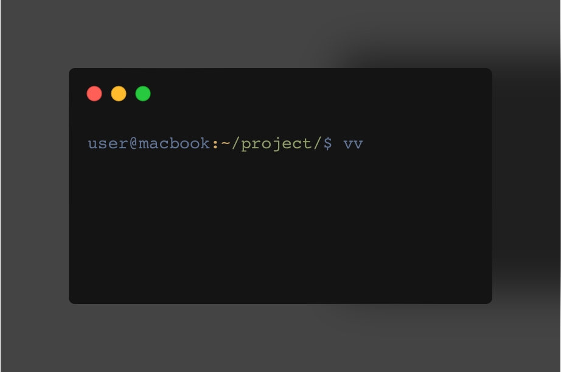

### vv

  <!-- <p align="center">
    
  </p> -->

***

`vv` is a simple scripted shell tool meant to be used for toggling virtual environments for `venv` and `uv` projects.

it is a drop in replacement for `source .venv/bin/activate` and `deactivate`.


  


#### Usage

From the root of your project (the directory containing `.venv`), run:
```zsh
vv
```


#### Project Structure

```zsh
  vv/
    README.md
    LICENSE
    vv.sh
    test/
      vv.bats
    Formula/
      vv.rb
```


